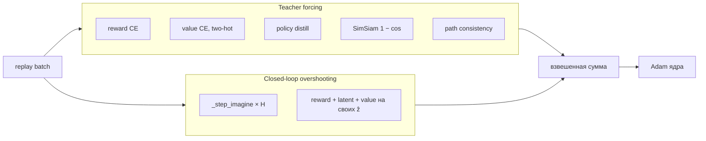

# LatentImZero v10.1

**Search as an optional learned computational action.**

Наследник ResearchImZero: тот же Transformer world model, тот же Gumbel search и тот же teacher-forced train. Поверх — три изолированных расширения: uncertainty-зонд, path consistency и value-of-computation (VoC) контроллер ширины поиска. Ядро Research не получает градиентов от sidecar-оптимизаторов.

Реализация: `rl_core/algorithms/native/latentimzero.py` наследует `NativeResearchImZero`. Чекпоинт-схема v11, метки VoC schema v3. `force_research_mode=1` выключает все расширения и даёт побитово тот же ResearchImZero.

---

## 1. Что за алгоритм

LatentImZero — model-based RL в семействе MuZero / EfficientZero / UniZero.

На каждом реальном шаге среды:

1. Наблюдение токенизируется и дописывается в каузальный Transformer (история `[obs, act, obs, act, …]`).
2. Из корня запускается поиск в *воображении*: динамика предсказывает следующий latent-токен, без вызова среды.
3. Из дерева берётся improved policy и действие в среду.
4. Переход пишется в replay. Несколько раз за итерацию сеть учится teacher-forcing + closed-loop overshooting.

VoC решает не «куда идти», а **сколько compute потратить**, прежде чем остановиться. Бюджеты фиксированы: `{0, 4, 16, 32}` симуляций. Стадия `0` — чистый актор (без поиска).

---

## 2. Карта системы

```mermaid
flowchart TB
  subgraph env [Среда]
    E[NetHackEat / Gym]
  end

  subgraph wm [World model — ядро ResearchImZero]
    Tok[Tokenizer / CNN encoder]
    AE[Action embed]
    TF[Causal Transformer + RoPE + KV-cache]
    H[Heads: policy · value · reward · latent]
    SS[SimSiam projector / predictor]
    EMA[EMA target copy]
  end

  subgraph search [Поиск]
    G[Gumbel-Top-k + Sequential Halving]
    IMG["_step_imagine: act-token → latent → next-obs-token"]
    VoC[VoC classifier: STOP / CONTINUE]
    Floor[Safety floor ∈ {0,4,16,32}]
  end

  subgraph side [Sidecar, отдельные оптимизаторы]
    UP["_SearchUncertaintyProbe"]
    VC["_VoCClassifier"]
  end

  subgraph mem [Память]
    BUF[Episode replay + PER + recent + success]
  end

  E -->|obs| Tok --> TF
  AE --> TF --> H
  H --> G
  IMG --> G
  G -->|policy_target, action| E
  G --> BUF
  VoC --> Floor --> G
  UP -.->|search-only bonus / SVE mix| G
  H -->|detached features| UP
  H -->|detached root hidden| VC
  BUF --> Train[Train step]
  TF --> SS
  EMA --> Train
```

**Жёсткая изоляция.** Uncertainty-зонд и VoC-классификатор видят только `detach()` скрытых состояний. Их Adam не пересекается с Adam ядра. Единственный *дополнительный* лосс, который трогает value-голову ядра — path consistency.

---

## 3. World model

Последовательность токенов, как в UniZero: на каждый переход два токена — наблюдение и действие.

| Модуль | Роль |
|---|---|
| `Tokenizer` | `obs → ℝ^E`, для картинок CNN (`Conv 1→32→64` + MLP → 128 на NetHackEat) |
| `ActionEmbed` | дискретное one-hot или непрерывный вектор → `ℝ^E` |
| `CausalTransformer` | 2 слоя, 4 головы, RoPE, incremental KV-cache |
| `_Heads` | общий trunk `Linear→ELU`; четыре выхода |
| SimSiam `projector` / `predictor` | consistency без target-сети (BN против коллапса) |
| EMA-копии tokenizer / embed / transformer / heads | только n-step bootstrap, Polyak `θ ← (1−τ)θ + τ θ_online` |

**Головы** (после trunk на hidden состояния токена):

- **policy** — на obs-токене: logits (дискрет) или Gaussian (непрерывный).
- **value** — на obs-токене: categorical support размера `2S+1`, `S=300`, two-hot.
- **reward** — на action-токене: тот же support, скаляр награды *этого* ребра (не value-prefix LSTM, как в EfficientZero).
- **latent** — на action-токене: `tanh` предсказание следующего obs-токена. Это и есть dynamics.

Скаляр из категориальной головы: signed hyperbolic / two-hot, как в MuZero.

**KV-cache.** У каждой параллельной среды (`num_envs=24`) живёт cache реальной истории длины `2 × context_length` (`context_length=6` → 12 токенов). Search не переигрывает прошлое с нуля: дописывает текущий obs и воображает дальше. На `done` cache обнуляется.

---

## 4. Один шаг поиска (ребро дерева)

```text
parent KV-cache
    │
    ▼
action embed(a)  ──incremental TF──►  h_act  ──► reward(h_act)
                                           ──► latent(h_act) = ẑ
    │
    ▼
ẑ  ──incremental TF──►  h_obs  ──► policy(h_obs), value(h_obs)
```

Это `_step_imagine`. Среда не вызывается. Один batched call на все живые листья всех 24 деревьев.

Backprop по дереву: `G(leaf) = r + γ V(next)`, min-max нормализация completed Q, Sequential Halving сужает множество корневых кандидатов.

---

## 5. Планировщик: Gumbel + VoC

ResearchImZero по умолчанию крутит фиксированный (или model-error-scheduled) бюджет `B` симуляций и в конце снимает improved policy.

LatentImZero v10.1 подменяет это **одним max-schedule планировщиком** с чекпоинтами.

### 5.1. Один планировщик, не четыре поиска

Gumbel-шум, множество корневых кандидатов и расписание Sequential Halving сэмплируются **один раз** на бюджет 32. Чекпоинт `B ∈ {0, 4, 16, 32}` — это *состояние того же дерева* после `B` expansion, а не отдельный поиск с другим `num_simulations`.

```text
B = 0     актор: argmax / sample π_θ(a|s), без модели
B = 4     small
B = 16    medium
B = 32    max  ← потолок, он же num_simulations
```

### 5.2. VoC-классификатор

Вход: `concat(root_hidden.detach(), scalars)`, scalars (7 шт.) — нормализованная энтропия актора, stage index, spent/max budget, epistemic uncertainty корня, ambiguity политики и т.д.

Выход: логит `P(CONTINUE)` на ребре `stage → stage+1`. Порог `voc_threshold = 0.5`.

- `P ≥ 0.5` → запросить следующий бюджет.
- `P < 0.5` → STOP на текущем чекпоинте.

Отдельный Adam (`voc_learning_rate = 1e-4`), replay меток на 20k.

### 5.3. Что исполняется

```text
requested  = VoC STOP/CONTINUE по чекпоинтам
permitted  = max(predicted, safety_floor)     если не shadow / не audit
executed   = сколько expansion реально сделали
```

- **Shadow** (старт): всегда `executed = 32`, VoC только предсказывает. После первого успешного unlock `shadow=false` навсегда.
- **Safety floor** ∈ `{0,4,16,32}`: нельзя остановиться ниже открытой стадии.
- **Audit** (5% random + 5% targeted по uncertainty): форсирует полный бюджет, чтобы собрать честные метки.
- **Eval / reanalyze**: всегда полный бюджет, VoC не учится и не двигает safety.

Действие в среду берётся с *исполненного* чекпоинта, не с предсказанного.

### 5.4. Метки VoC

Не visit-scaled completed-Q (это ломало v10). Схема v3:

на полном дереве для соседних чекпоинтов `(B_k, B_{k+1})` общий EMA **one-step evaluator** один раз оценивает действия обоих чекпоинтов. Marginal label: стоит ли платить `c · ΔB` extra expansion (`voc_compute_cost_per_expansion = 0.001`), нормированное на `voc_return_scale`.

Классификатор учится BCE на этих CONTINUE/STOP.

### 5.5. Safety (v10.1)

На каждое ребро `actor→small`, `small→medium`, `medium→max` отдельно:

**Unlock** (нужна серия из `voc_safety_patience=20` безопасных проверок):

- ≥ 128 labels, ≥ 64 audits, ≥ 64 STOP-аудитов;
- ≥ 64 абсолютных STOP **и** CONTINUE в labels (не процентный порог);
- premature exceedance / p95 / **mean-positive** ниже поэтамных порогов  
  mean-positive = `E[max(R_premature, 0)]` по **всем** predicted STOP, включая нулевые;
- stop precision ≥ 0.8.

**Relock**, если уже открытая стадия регрессирует по тем же premature-гейтам (или catastrophic Brier / divergence ×3).

Health-check в 100k шагов: desync requested vs executed, collapse в actor-only, missing edges. До этого `warming_up`.

---

## 6. Uncertainty sidecar

`_SearchUncertaintyProbe`: 2 bootstrap-члена, reward- и value-головы на `detach(h)`. Отдельный Adam.

- **Не** пишет в replay reward.
- **Не** даёт градиент в ядро.
- **Может** (консервативно):
  - добавить search-only бонус к ребру дерева (`uncertainty_bonus_coef=0.05`, warmup 5k → ramp 20k → anneal 100k–250k);
  - смешать SVE (`uncertainty_sve_beta`);
  - чуть расширить число симуляций Research-пути (`uncertainty_extra_simulations_max=4`) — на VoC-пути ширину задаёт только VoC.

Disagreement членов — оценка эпистемической неопределённости. Попадает в scalars VoC как `root_epistemic`.

---

## 7. Replay

`_ResearchImZeroBuffer` — эпизодный, с незавершёнными lane-буферами (`_cur`). Сэмплировать можно до конца эпизода.

Смесь батча (`batch=64`):

| Доля | Источник |
|---|---|
| 0.50 | recent window (512 переходов) |
| 0.15 | success pool (верхний квантиль return) |
| остальное | PER, `α=1`, `β` anneal 0.4→1 |

Приоритет: `|V − V_target|` + вес ошибки политики + learning-progress бонус (если ошибка *уменьшилась* с прошлого обучения).

Reanalyze каждые 200 шагов, батч 64: холодный replay контекста в cache → полный search → обновить `policy_target` и `search_value` в буфере. Staleness: search value старше 5 поколений игнорируется.

---

## 8. Train step

После `learning_starts=500`, каждый `train_freq=1` векторный шаг: `train_steps_per_iter ∈ [2, 4]` (адаптивно от ошибки модели). AMP bf16.

Окно: `unroll_steps=5` teacher-forced токенов поверх контекста.



### 8.1. Value target

n-step TD с bootstrap с **EMA** сети, и landing state сидит в том же контексте, что и голова (не голый один токен):

\[
V^{\text{TD}}_{t} = R_{t:t+n} + \gamma^{n}\, V_{\bar\theta}(s_{t+n} \mid \text{context})
\]

Если search value свежий:

\[
V^{\text{tgt}} = (1-\lambda)\, V^{\text{TD}} + \lambda\, V^{\text{search}}, \quad \lambda \le 0.25
\]

SVE-mix может ещё сжаться, если uncertainty-зонд не доверяет модели. **Не** `max(TD, search)` — это убрали после spike-then-degrade.

### 8.2. Остальные лоссы ядра

| Лосс | Коэф. | Что |
|---|---|---|
| reward | 1.0 | two-hot CE на action-токене |
| value | 0.25 | two-hot CE |
| policy | 1.0 | CE к improved policy поиска (дискрет) / MSE к visit-mean action (continuous) |
| consistency | 2.0 | SimSiam: `latent(h_act)` vs tokenizer(next_obs), `1 − cos` |
| path consistency | 0.1 | \(V(s_k) \approx r_k + \gamma V(s_{k+1})\) вдоль unroll, единственный extra-лосс в value |
| closed-loop | 0.5 | на доле батча 0.25 рекурсивный `_step_imagine` на *своих* latent, горизонт 3–5 |
| entropy | −0.005 | бонус, вычитается |

Closed-loop горизонт растёт, когда latent-error EMA низкая (`adaptive_closed_loop`). Вес шага `0.8^k`.

Adaptive Kendall-веса только у reward/value/policy (у consistency нет noise floor — его не адаптят).

Градиент клипается `max_grad_norm=5`. LR `2e-4`, линейный decay до 5%.

Uncertainty probe и VoC после основного шага доучиваются со своих батчей, без `backward` в ядро.

---

## 9. Внешний цикл `learn()`

```text
reset 24 сред
пока t < T:
    если t < 500:          случайные действия, без поиска
    иначе:                 search(obs, lane_KV_cache)  →  a, π̂, метаданные VoC
    env.step(a)
    buffer.add(переход, в т.ч. незавершённый эпизод)
    обновить KV-cache: дописать action (или сбросить на done)
    t += 24
    если пора:             train_steps раз _train_step()
    если t % 200 == 0:     _reanalyze()
    callback метрик
```

Сбор и поиск — `inference_mode`. Граф строится только в `_train_step`.

---

## 10. Поток данных одного env-step

```text
obs_t
  │
  ├─► tokenizer ─► Transformer(+cache) ─► h_root
  │                      │
  │                      ├─► π_θ, V_θ          (актор, чекпоинт 0)
  │                      ├─► uncertainty probe  (detach)
  │                      └─► VoC P(CONTINUE|stage) (detach)
  │
  ├─► если floor/VoC требуют поиск:
  │       repeat B times:
  │         Gumbel select → _step_imagine → expand → backup
  │         at {4,16,32}: snapshot policy, maybe STOP
  │
  ├─► a_t ~ π_improved(checkpoint_executed)
  ├─► env → r_t, obs_{t+1}, done
  └─► replay ← (obs, a, r, π̂, V_search, budget, audit, …)
```

---

## 11. Что *не* является частью ядра

| Есть в коде | Влияние на ядро |
|---|---|
| RND (`intrinsic_exploration`) | выкл. по умолчанию; если вкл. — плюсуется в replay reward |
| model-error scheduler ширины | в v10.1 **выключен**, пока VoC включён; остаётся только в `force_research_mode` |
| `max(TD, search_value)` | нет, convex mix |
| Dirichlet-шум | нет, исследование = Gumbel на корне |
| второй world model / ensemble dynamics | нет, uncertainty — мелкий зонд на тех же фичах |

---

## 12. Дефолты, с которыми идут раны NetHackEat

| | |
|---|---|
| embed / layers / heads | 128 / 2 / 4 |
| context / unroll / td | 6 / 5 / 5 |
| поиск max | 32, top-k 8 |
| VoC budgets | 0, 4, 16, 32 |
| batch / buffer | 64 / 2000 эпизодов |
| train | 2–4 шага / итерация, AMP |
| num_envs | 24 |
| γ | 0.99 |

На картиночном NetHackEat сеть ≈ 16.3M параметров, из них ≈ 8.2M обучаемых (остальное EMA-копии).

---

## 13. Как читать метрики рана

| Метрика | Смысл |
|---|---|
| `episode_reward_mean` | среднее по завершённым эпизодам — основная метрика sample efficiency |
| `search_budget_mean` / `executed_search_expansions` | сколько expansion реально сделали |
| `shadow_predicted_budget_mean` | что хотел VoC |
| `voc_minimum_budget` | safety floor |
| `requested_stage_fraction_*` | куда контроллер реально направил |
| `predicted_stage_fraction_*` | куда хотел бы без пола |
| `voc_health_warming_up` | 1 до 100k по дизайну |
| `search_model_error_ema` | ошибка мира; закрытый цикл смотрит на неё |
| `closed_loop_latent_error_ema_h*` | train/search gap по горизонту |
| `policy_entropy` | схлопывание π |

---

## 14. Одной фразой

**ResearchImZero учит Transformer предсказывать следующий токен, награду и ценность, и дистиллирует Gumbel-дерево в политику. LatentImZero оставляет это ядро нетронутым и добавляет право *не* искать: отдельный классификатор решает, окупается ли следующая порция compute, а safety не даёт остановиться раньше, чем это проверено аудитом.**
